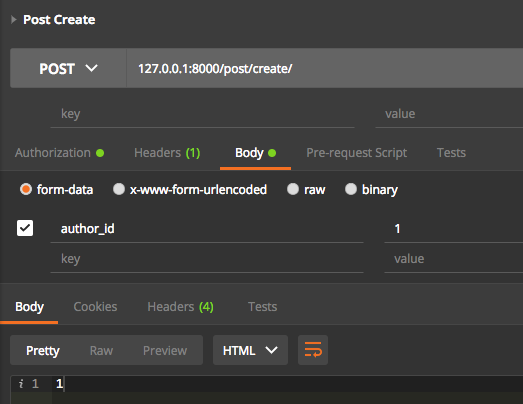
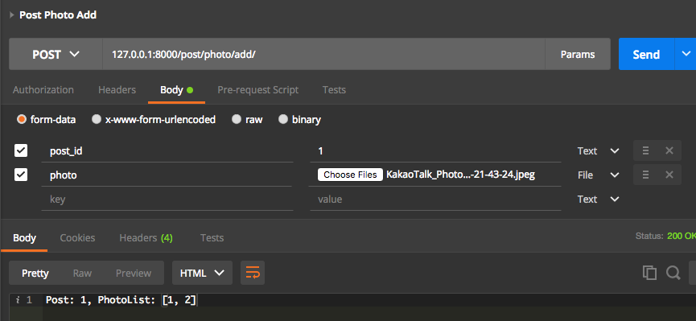
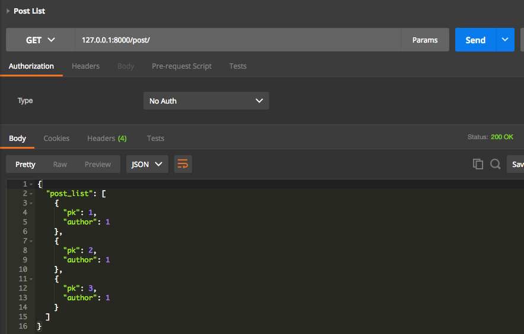

# API(1)

## InstagramAPI

예전에 만들어보았던 Instagram에서 API를 생성하는 과정을 연습해본다. 

### 기본세팅

우선 InstagramAPI를 프로젝트를 새로 만들고 기본적인 세팅을 한다. 

```
.conf, .conf-secret, settings.py(config), git, requirements.txt...
```

member 앱을 생성하고 MyUser모델이 AbstractUser를 상속받도록 한다. 그리고 settings.py에서 `AUTH_USER_MODEL`을 설정한다. 

---

### model

인스타그램처럼 하나의 글에 사진 여러장이 올라갈 수 있도록 설계한다. 

post 앱을 생성한다.

> post/models.py

```python
class Post(models.Model):
	author = models.ForeignKey(Settings.AUTH_USER_MODEL)
	created_date = models.DateTimeField(auto_now_add=True)
    
    
class PostPhoto(models.Model):
	post = models.ForeignKey(Post)
	photo = models.ImageField(upload_to='post')
```

ImageField를 활용하기 위해 pillow를 설치한다.

```
pip install pillow
```

모델을 구성했으니 migration을 하고 커밋

```
MODE='DEBUG' ./manage.py makemigrations

git commit -a -m 'InstagramAPI - Post, PostPhoto 모델 추가 및 migration 생성'
```

---

### order_with_respect_to

현재 PostPhoto가 Post에 연결된 것은 확인되지만 연결된 목록의 인덱스가 따로 지정되어 있지 않다.

PostPhoto에 다음을 추가한다

```
class Meta:
    order_with_respect_to = 'post'
```

order_with_respect_to는 ForeignKey에 대해 순서를 붙여준다.

이 설정이 되면 `get_RELATED_order()`와 `set_RELATED_order()`함수가 자동적으로 추가된다. 여기서 RELATED는 연결되어 있는 모델명의 소문자형태이다.

따라서, 현재 PostPhoto에 연결되어 있기 때문에 get_postphoto_order형태가 된다.

psycopg2가 설치되어 있지 gi않다면 설치하도록 한다.

```
pip install psycopg2
```
migrations를 생성하고 커밋.

```
git commit -a -m 'InstagramAPI - PostPhoto에 
order_with_respect_to Meta옵션 설정 및 migrations 생성'
```

---

### view

post_craete 뷰는 다음 동작을 수행한다.

```
request.Post로 전달된 author_id를 받아 새 Post를 생성한다.  
생성된 post의 id값을 HttpResponse로 반환한다. 
받은 author_id에 해당하는 MyUser객체를 가져오는데 없다면 해당 User가 없음을 반환한다.
```

> model/views.py

```python
User = get_user_model()

@csrf_exempt    #API로 요청할 때 csrf 해제, 누구나 접근 가능한 상태.
def post_create(request):
    if request.method == 'POST':
        try:
            author_id = request.POST['author_id']
            author = User.objects.get(id=author_id)
        except KeyError as e:
            return HttpResponse('key "author_id" is required field')
        except User.DoesNotExist:
            return HttpResponse('author_id {} does not exist'.format(
                request.POST['author_id']
            ))
            
        post = Post.objects.create(author=author)
        return HttpResponse('{}'.format(post.pk))
    else:
        return HttpResponse('Post create view')
```

url을 연결한다.

> config/urls.py

```
url(r'^post/', include('post.urls'))
```

> post/urls.py

```
url(r'^create/$', views.post_create, name='create')
```

runserver를 실행해서 잘 나오는지 확인해본다.

`localhost:8000/post/create/`라는 명령어를 입력했을 때 Post create view라는 메시지가 나와야 한다.

현재 GET방식으로 보내는 상황이기 때문에 view에서 else로 간 상태이다.

---

### CustomScripts

이번에는 매번 불편하게 길게 입력했던 runserver 명령을 script로 간소화해보자. 

```
MODE='DEBUG' ./manage.py runserver
-->
manage -d runserver
```

위와 같이 manage -d runserver 만으로 긴 명령을 처리할 수 있다. 스크립트 방식의 장점은 코드를 다 살펴보고 다시 알아보자.

우선 script 디렉토리에서 manage 파일에 대한 내용을 작성한다.

```
vi ~/.scripts/manage

#!/bin/bash

while getopts "d" opt
do
	case $opt in
		d) mode='DEBUG';;
	esac
done

manageCommand="MODE='$mode' ./manage.py ${@:OPTIND}"
echo $manageCommand
eval $manageCommand
```
파일을 작성하고 권한을 재설정한다. 

```
chmod 755 ~/.scripts/manage
```

zshrc에서도 script에 대한 경로를 설정한다.

```
vi ~/.zshrc

export CustomScript="/Users/lewis/.scripts"
export PATH="$PATH:$CustomScripts"
```

세팅이 완료되면 source ~/.zshrc로 변경사항을 반영한다. 

현재는 디버그 모드에서 서버를 실행하려고 하는 설정만 했다. 나중에는 디버그 모드로 실행시 서버는 리모트 혹은 로컬 중에 선택하는 명령 등 다양한 옵션을 간단하게 추가할 수 있다. 스크립트로 처음에 짜는 것이 귀찮을 수 있지만 나중에 작업이 원활히 진행될 수 있도록 도와준다.

---

### Postman에서 /post/create 요청하기

현재 Postman에서 요청을 할 수 있는 url은 다음과 같다.



/post/create/ 에서 POST요청을 받으면 생성하는 루틴으로 진입한다. 이 때 author_id가 반드시 필요하기 때문에 Body 탭에서 값을 채워준다. Send를 누르면 화면의 맨 아래처럼 생성된 post의 id가 출력된다.

---

### post_photo_add view

post id, photo를 받아서 PostPhoto 객체를 생성한다. 이후 post_id와 post에 연결된 photo들의 id값을 반환한다.

> post/views.py

```python
@csrf_exempt
def post_photo_add(request):
    if request.method == 'POST':
        try:
            post_id = request.POST['post_id']
            photo = request.FILES['photo']
            post = Post.objects.get(id=post_id)
        except KeyError:
            return HttpResponse('post_id and photo are required fields')
        except Post.DoesNotExist:
            return HttpResponse('post_id {} is not exist'.format(
                request.POST['post_id']
            ))
        PostPhoto.objects.create(
            post=post,
            photo=photo
        )
        return HttpResponse('Post: {}, PhotoList: {}'.format(
            post.id,
            [photo.id for photo in post.postphoto_set.all()]
        ))
    else:
        return HttpResponse('Post photo add view')
```

이 view에 대한 url을 설정한다. 

> post/urls.py

```
url(r'^photo/add/$', views.post_photo_add, name='photo_add'),
```

postman에서 테스트 해본다. 



view에서 필요한 데이터는 post_id와 photo다. postman에서 Body탭에서 해당 데이터를 설정해준다. 여기서 photo는 우측에 `Text`버튼을 누르면 `File`로 변경할 수 있다. `File`모드에서 원하는 이미지를 로드하고 Send하면 하단과 같이 1번 Post의 photolist를 출력한다. (현재는 Send를 두번 누른 상태라서 1,2가 출력되었다.)

현재 상태에서는 이미지를 추가하면 의도치 않은 경로로 저장될 것이다. settings.py에서 MEDIA관련 설정을 해주도록 한다.

---

### 딕셔너리 형태의 API

전체 Post를 딕셔너리 형태로 반환해주는 작업을 한다. 우선 post list 정보를 불러오는 뷰를 생성한다. 

> post/views.py

```python
def post_list(request):
	post_list = Post.objects.all()
	context = {
		'post_list': post_list,
	}
	return JsonResponse(data=context)
```

post의 전체 내용을 읽어서 Json형태로 변환하여 반환해주는 시나리오가 자동적으로 되면 좋겠지만 그렇게 되지 않는다. **인스턴스 자체를 바로 Json형태로 만들어주는 것이 불가능하다.** 따라서 다음과 같이 인스턴스를 딕셔너리 형태로 만들어줘야 한다. 

```python
def post_list(request):
    post_list = Post.objects.all()
    post_dict_list = []
    for post in post_list:
        cur_post_dict = {
            'pk': post.pk,
            'author': post.author.pk,
        }
        post_dict_list.append(cur_post_dict)
    context = {
        'post_list': post_dict_list,
    }
    return JsonResponse(data=context)
```

Post의 모든 객체를 순회하면서 각 post와 post의 author의 pk를 딕셔너리 형태로 저장한다. 그리고 이 딕셔너리를 리스트에 추가한다. 딕셔너리 데이터들이 추가된 리스트를 context로 실어서 보낸다.

url을 지정한 뒤 postman에서 테스트 해보자.

> post/urls.py

```
url(r'^$', views.post_list, name='list'),
```



/post/에 GET방식으로 요청한다. 사진의 아래부분을 보면 딕셔너리 형태로 pk들이 나열된 것을 확인할 수 있다. 현재 post가 3개 존재하기 때문에 3개의 데이터가 출력되었다.


